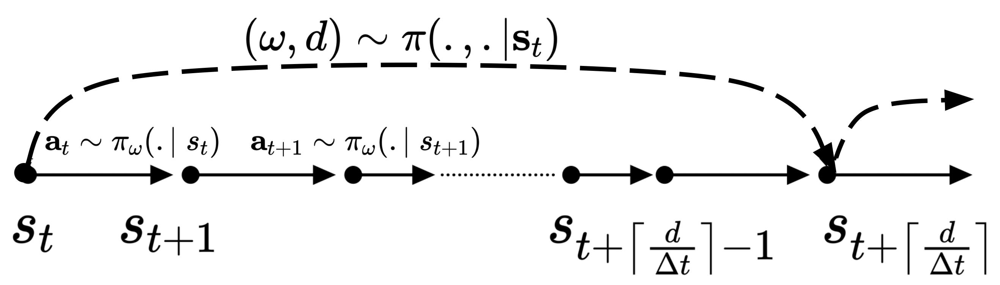
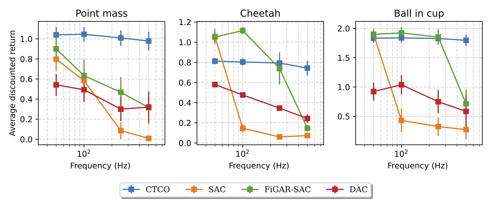
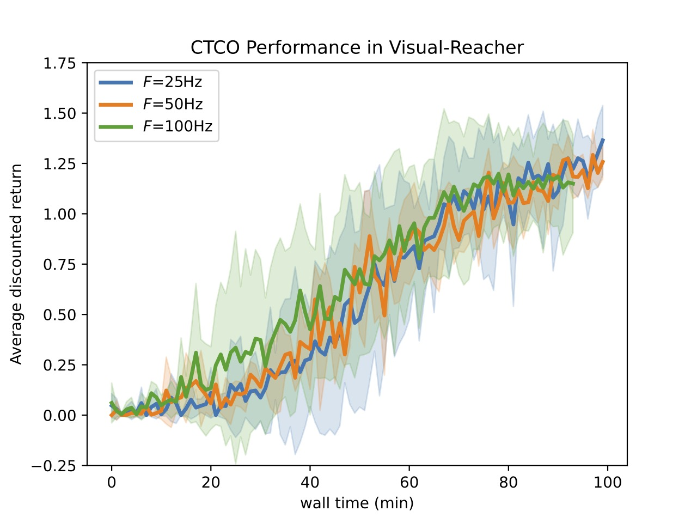
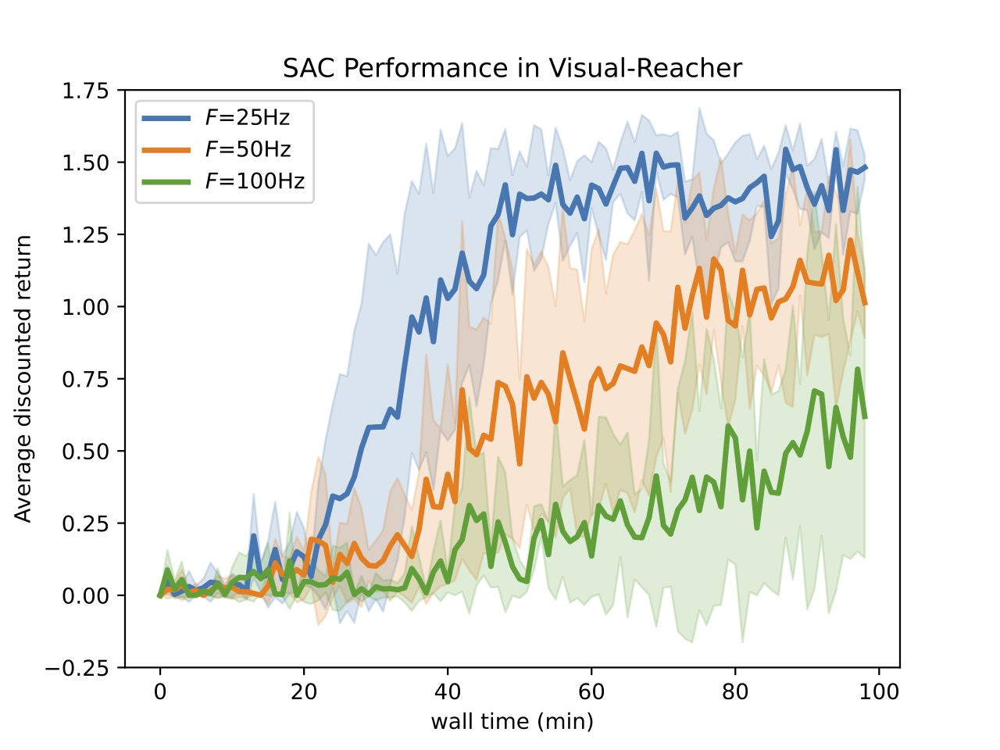

# continuous-time-continuous-option-policy-gradient
This repository contains the implementation for the continuous time continuous opiton (CTCO) policy gradient algorithm. In this algorithm, extended actions paired with duraiton of execution are chosen to construct options with open-loop policies to improve the exploraiton in continuous control tasks. The trajectory of low-level actions are parameterized by some $\omega$ and executed for continuous time $d$ independent of the task action-cycle-time $\Delta t$.

# Results
CTCO is evaluated against classic RL (SAC), action repetition RL (FIGAR-SAC) and hierarchical RL (DAC) methods for simulated continuous control tasks in different interaction frequencies.

We have also evaluated the CTCO performance in the  real-world task of visual reacher with Faranka robotic arm.

  
   

# Video of the algorithm in action can be found [here](https://drive.google.com/file/d/1To3a9e2yLDT6hiJvGhnFA_65emc3vjZw/view?usp=share_link)
