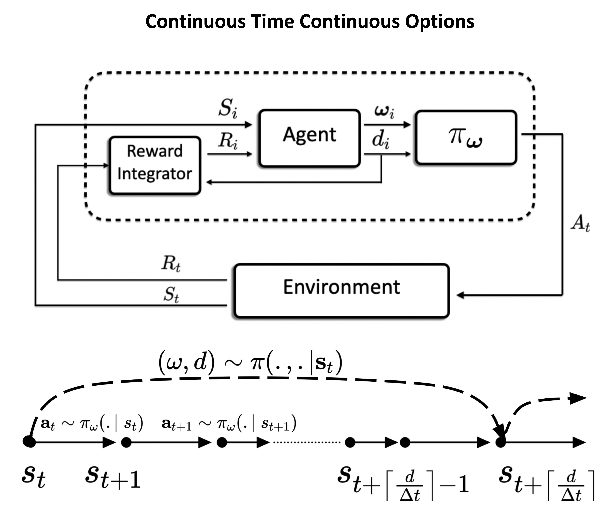

# continuous-time-continuous-option-policy-gradient
This repository contains the implementation for the Continuous Time Continuous Option (CTCO) Policy Gradient Algorithm. 
Associated paper [Dynamic Decision Frequency with Continuous Options](https://arxiv.org/abs/2212.04407)

In this algorithm, extended actions paired with duration of execution are chosen to construct options with open-loop policies to improve the exploration in continuous control tasks. The trajectory of low-level actions is parameterized by some $\omega$ and executed for continuous time $d$ independent of the task action-cycle time $\Delta t$

# Results
CTCO is evaluated against classic RL (SAC), action repetition RL (FIGAR-SAC) and hierarchical RL (DAC) methods for simulated continuous control tasks in different interaction frequencies.

We have also evaluated the CTCO performance in the real-world task of visual reacher with Faranka robotic arm.

  
  
    

# Video of the algorithm in action can be found [here](https://drive.google.com/file/d/18W6ULtbuZJ7vfKOG0JiVzzDBA5MipFhi/view?usp=share_link)
